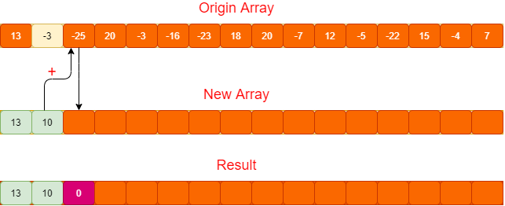

# Maximum subarray in dynamic programming

Dynamic programming is a computer programming optimization method. Every new decision is based on previous efforts. So this method is pretty efficient.

## Description

Given that an array with sixteen elements, you need to find the consecutive elements with the max summation among the array.

Subarray: such as [13, -3, -25], or [-3, -16, -23] or [18, 20, -7, 12] and so on. The elements of the subarray must be consecutive in the origin array.

```nim
let data = [13, -3, -25, 20, -3, -16, -23, 18, 20, -7, 12, -5, -22, 15, -4, 7]
```


## A dead simple solution

A dead simple solution is to consider all subarrays. From index zero, calculate all possible subarrays([13], [13, -3], [13, -3, -25], ...). Then increase the start index by one until the last index.

```nim
let data = [13, -3, -25, 20, -3, -16, -23, 18, 20, -7, 12, -5, -22, 15, -4, 7]

var maxElem = 0
for i in 0 ..< data.len:

  var value = 0
  for j in i ..< data.len:
    inc(value, data[j])
    if value > maxElem:
      maxElem = value

echo maxElem
```
However, the algorithm doesn't scale well. The time complexity of the algorithm is O(n ^ 2).

## Dynamic programming solution

Dynamic programming looks like filling in the form. The current cell makes use of the result of previous cell. We use one-dimension form to solve this problem. As the form is filled, the problem is solved.

Let's look at the problem closely. It asks us to calculate the result of the maximum subarray. 

First we need a new array of the same length as the origin array. Then we begin to fill in the new array. The new array stores the summation of the current maximum subarray. 

**How can we get the summation?**

The current summation is equal to the value in the origin array plus the previous summation of maximum subarray in the new array.

First we should initialize the new array with the first element in the origin array. This is a start condition.


Then we can calculate the current cell from the first cell.


So the maximum subarray is composed of the previous maximum subarray and the current element in the origin array. But be careful. When an element in the origin array is too small, it maybe become an obstacle for getting the maximum subarray. Namely, if the previous maximum subarray plus the current value in the origin array is less than 0, this means that the current maximum subarray can't bring gains to the following maximum subarray. we should set this cell to 0. And the new subarray will begin from the next cell.



Final solutions

```nim
proc findMaxValue*(arr: openArray[int]): int =
  ## Returns the value of maximum subarray.
  if arr.len > 0:
    var store = newSeq[int](arr.len)
    store[0] = arr[0]
    result = arr[0]

    for idx in 1 ..< arr.len:
      store[idx] = store[idx - 1] + arr[idx]

      # can't get gains
      if store[idx] < 0:
        store[idx] = 0

      # store the max value
      if store[idx] > result:
        result = store[idx]


let data = [13, -3, -25, 20, -3, -16, -23, 18, 20, -7, 12, -5, -22, 15, -4, 7]
echo findMaxValue(data) 
# Output: 43
```

[Source code](../code/c1)